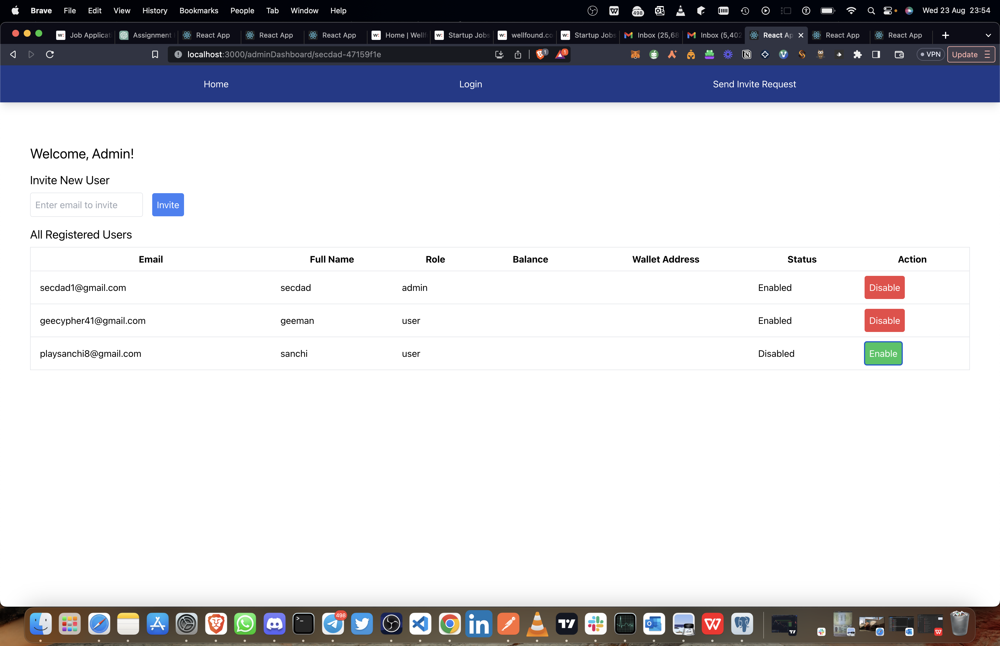
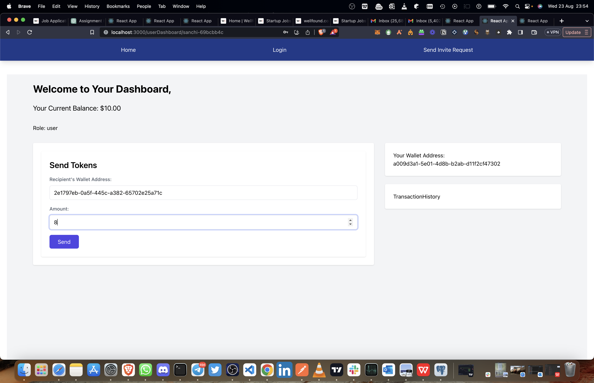
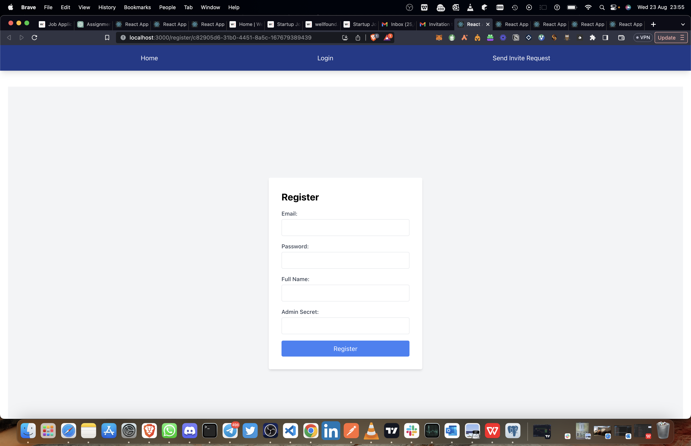

# IvoryPay Assesment: E-wallet platform to send and recive money

A robust fullstack web application that enabes users to send and receive Money through their wallets. Admins have to power to manage all users. 

## Table of Contents
- [IvoryPay Assesment: E-wallet platform to send and recive money](#ivorypay-assesment-e-wallet-platform-to-send-and-recive-money)
  - [Table of Contents](#table-of-contents)
  - [Features](#features)
  - [Technologies Used](#technologies-used)
  - [Screenshots](#screenshots)
  - [Video Walkthrough](#video-walkthrough)

## Features
- **User Invitation**: Users and Admins can only register through invitations. Admins can invite users via email as well.
- **User Log-in** Users and Admins can login to their dashboards.
- **User Listing**: Admins have a dashboard to View a list of all registered users with essential details.
- **Toggle User Status**: Admins can enable or disable user accounts.
- **User Wallets**: Upon registration, users wallets are created for them.
- **Send Money**: Users can send money to Other Users through their wallets.

## Technologies Used
- **Frontend**: React.js
- **Backend**: Express.js with Node.js
- **Database**: PostgreSQL
- **Others**: Axios for HTTP requests.

## Screenshots

1. **Admin Dashboard**
   

2. **User Invitation**
   

3. **User DashBoard**
   

4. **User registration**
   

## Video Walkthrough
[Click here to view the video walkthrough](https://youtu.be/DVlMvT3Nxf4)

---

© 2023 Chidera Stanley Onwuatu. All Rights Reserved.